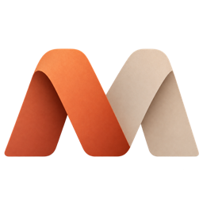
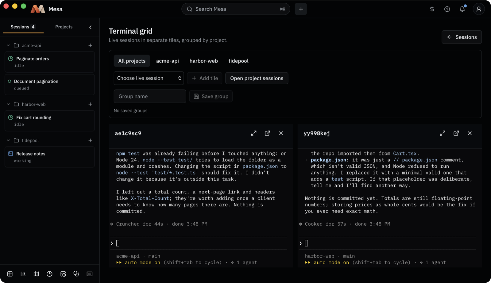
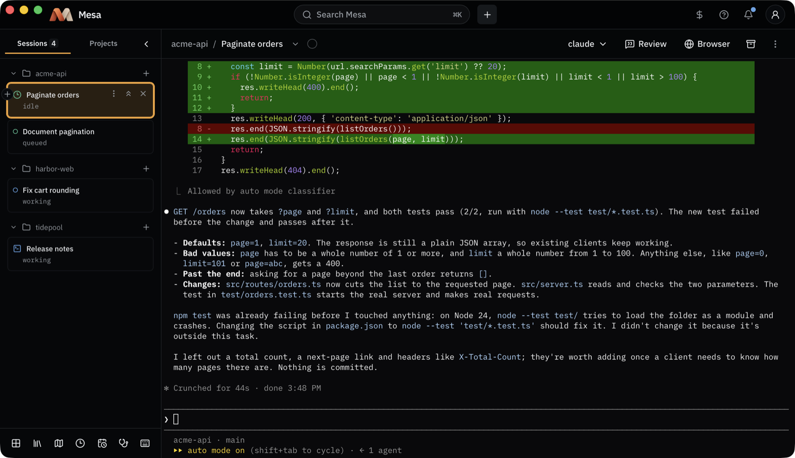
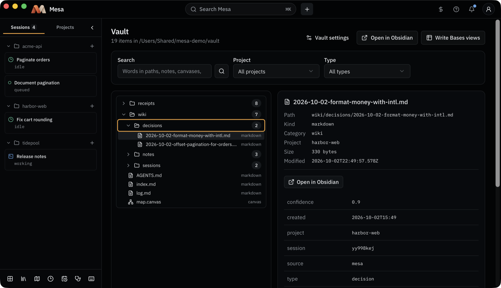
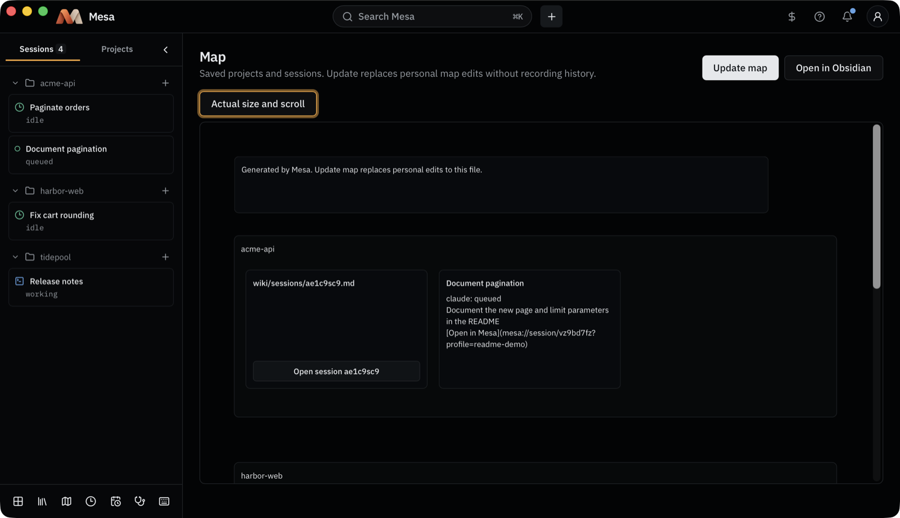

<p align="center">
  
</p>

<h1 align="center">Mesa</h1>

<p align="center">
  <strong>One Mac app for every coding agent session, across all your projects.</strong>
</p>

<p align="center">
  <a href="https://github.com/guillezorrilla/mesa/actions/workflows/ci.yml"></a>
  <a href="https://github.com/guillezorrilla/mesa/releases/latest"></a>
  <a href="LICENSE"></a>
  
</p>

<p align="center">
  
</p>

## What Mesa is

Running one coding agent in one terminal is easy. Running six across four repositories is not: you lose track of which one is waiting for an answer, which one finished, and what each decided last week.

Mesa runs Claude Code, Codex and Antigravity sessions for you, shows them all on one Board grouped by project, and keeps what they learn in an Obsidian vault so the next session starts with it. It is for developers who already work with coding agents and want to run several at once without a wall of terminal tabs.

Every session is the agent's own terminal UI, unchanged, running in tmux. Mesa adds the layer around it: where each session is, what it needs from you, and what it should remember.

## Features

- **Every session on one Board.** Sessions from all your projects in one sidebar, grouped by project, with what each one is doing. Open one to get its live terminal, or tile several in the terminal grid.
- **Claude Code, Codex and Antigravity.** Start any of them in a project, in a new Git worktree, or on a branch; swap the agent of a fresh session; queue a session to start after another ends; hand a session's work to a successor before its context fills.
- **The Obsidian vault as memory.** Each profile owns a vault of plain Markdown: project hubs, notes, decisions, session summaries and a project map. Sessions read and write it through the `mesa-vault` tools, and Obsidian opens it as is.
- **Faro, the decisions layer.** Recurring judgments, such as whether a prompt sent to a session is allowed, go through rules first and then an agent. Each decision is kept in a Receipt with its probabilities and confidence.
- **Import from Atlassian and Notion.** Connect once in the browser, then browse Jira, Confluence and Notion and tick the pages and issues to import; public web pages work by link. Each import lands in the vault as a snapshot plus a note, and can start a session.
- **The `mesa` CLI for everything the app does.** Every screen is backed by a command, and every command has `--json`, so scripts and agents can drive Mesa too.

<table>
  <tr>
    <td width="33%"></td>
    <td width="33%"></td>
    <td width="33%"></td>
  </tr>
  <tr>
    <td align="center">A session's live terminal</td>
    <td align="center">The vault, with a saved decision</td>
    <td align="center">The map of projects and sessions</td>
  </tr>
</table>

## Install

**Download** the DMG from the [latest release](https://github.com/guillezorrilla/mesa/releases/latest), open it, and drag Mesa to Applications. The first signed release is still being prepared; until it is out, [build from source](#building-from-source).

The `mesa` command ships inside the app. To use it from a terminal, link it onto your PATH:

```sh
mkdir -p ~/.local/bin && ln -s /Applications/Mesa.app/Contents/MacOS/mesa ~/.local/bin/mesa
```

**Requirements:**

- macOS 14 or later.
- [tmux](https://github.com/tmux/tmux): `brew install tmux`.
- At least one coding agent, signed in with its own subscription: [Claude Code](https://docs.claude.com/en/docs/claude-code), [Codex](https://github.com/openai/codex), or Antigravity. Mesa needs no API keys and has no account of its own.
- [Obsidian](https://obsidian.md) is optional: the vault is plain Markdown, and Obsidian is only needed to open it there.

## Quick start

1. **First run.** Open Mesa. A short tour walks through projects and sessions; you can leave it and resume it later.
2. **Add a project.** In Projects, choose **Add project** and pick a Git repository, or **Import workspace** to find every repository under a folder. The project appears in the sidebar.
3. **Start a session.** Press **+** beside the project. A session starts at once with the project's agent (Claude Code unless you chose another) and opens in its own terminal. The sidebar shows its state: working, waiting for an answer, idle, or queued.
4. **Use the CLI.** Everything above works from a terminal too:

```sh
mesa --help                                  # every command
mesa doctor                                  # check tmux, the agents, Obsidian, and the hooks
mesa hooks install                           # let Mesa follow each agent's state
mesa register ~/code/my-app --create         # add a project
mesa open my-app --goal "Fix the flaky login test"
mesa sessions                                # every session, highest attention first
mesa attach <session>                        # its terminal, right here
```

## How it works

`packages/core` holds all of Mesa's logic. `packages/cli` is the `mesa` command on top of it, and `apps/desktop` is a [Tauri 2](https://tauri.app) app whose every action runs that same CLI. Each session is a tmux window on the profile's own tmux server, so sessions keep running when the app closes and `mesa attach` reaches them from any terminal. The agents' hooks report each session's state back to Mesa. A profile (`~/.mesa/<profile>/`) holds the settings, the registered projects and the session records; its vault holds what should be remembered.

The terms Mesa uses are defined in [CONTEXT.md](CONTEXT.md). The decisions behind the design, with their evidence, are in [docs/adr/](docs/adr/).

## Privacy

- **Everything stays on your Mac:** your profile, session records and logs, Receipts, and the vault. Mesa has no server for any of them, no account, and no analytics.
- **The agents run as you,** with your own Claude Code, Codex or Antigravity sign-in. Mesa never handles those credentials.
- **Connecting Atlassian or Notion** goes through a small OAuth broker, a Cloudflare Worker ([ADR-0014](docs/adr/0014-oauth-broker-and-keychain-tokens.md)), because those vendors need a client secret that a desktop app cannot keep. The broker sees the sign-in code and the tokens as it passes them back to your Mac; it stores nothing and logs nothing. It never sees your pages or issues: Mesa calls the vendor's API directly from your Mac. Tokens are kept in the macOS Keychain, never in files. You can run your own broker and point Mesa at it with `MESA_BROKER_URL` (see ADR-0014).

## Building from source

Requires Node 24, pnpm 11, Rust stable, and tmux.

```sh
pnpm install
pnpm dev          # build core and the CLI, watch them, and launch the app
pnpm verify       # lint, typecheck, test, build: the gate every change passes
```

`pnpm dev` hot-reloads React and CSS edits. Core and CLI edits rebuild automatically and apply on the app's next action (reload or reopen a view to rerun its read). Rust edits rebuild and restart the app. Stop everything with Ctrl-C. Native notifications need a bundled `.app`, so they are off in `pnpm dev`. Use `MESA_PROFILE=<name> pnpm dev` to run against another profile. `pnpm dev:cli` runs only the core and CLI watcher, and `pnpm dev:desktop` only the app.

To use your checkout's CLI as `mesa`:

```sh
pnpm build
pnpm dev:link     # writes a shim at ~/.local/bin/mesa
mesa --version
```

The shim runs this checkout's `packages/cli/dist/mesa.js` with the node you ran it with, so `~/.local/bin` must be on your PATH. Run it again if you move the checkout or switch node.

## Contributing

Bug reports and ideas are welcome as [issues](https://github.com/guillezorrilla/mesa/issues). Pull requests from outside are not accepted for now. See [CONTRIBUTING.md](CONTRIBUTING.md).

## Security

Please report vulnerabilities privately, as [SECURITY.md](SECURITY.md) describes, not in a public issue.

## License

[MIT](LICENSE)
