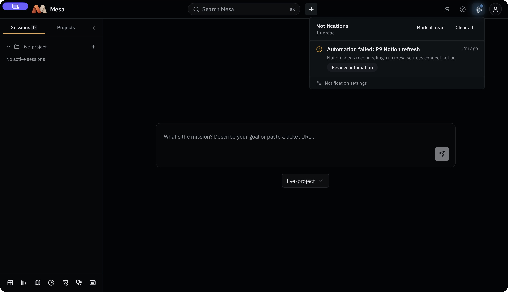
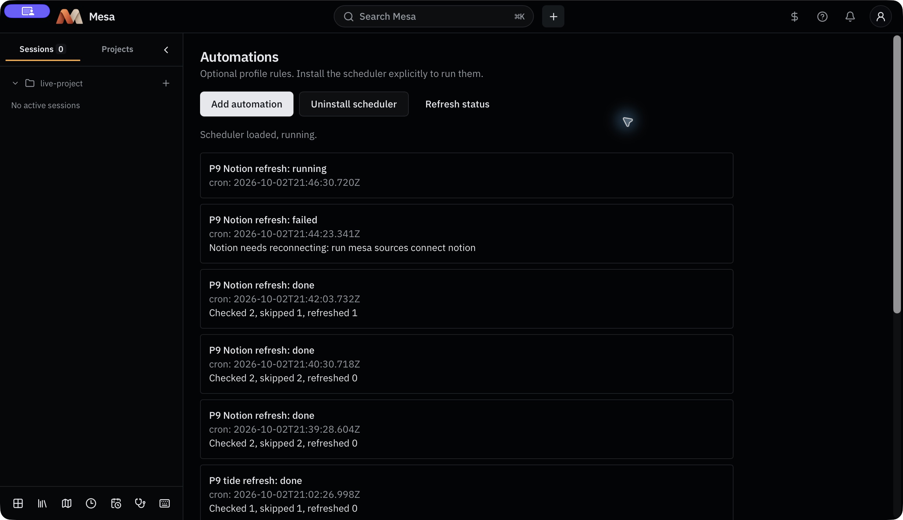
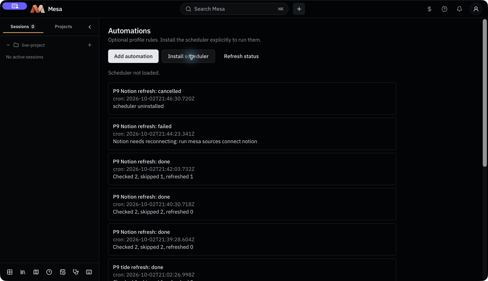
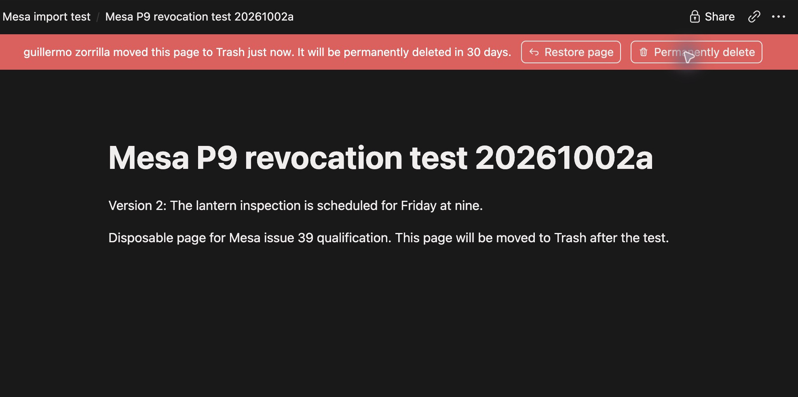

# Automation failure qualification

Date: 2026-10-02. Issue: #424, child of #39. Implementation: `3441976`.

A disposable profile, project, vault and uniquely identified macOS bundle exercised the real Notion API, the real GUI LaunchAgent, installed Claude Code and macOS UserNotifications. The owner explicitly identified the workspace's Mesa grant as disposable. The test created and edited only an invented child page beneath the supplied test page, then disconnected that Mesa grant in Notion. The parent page and other connections were preserved.

| Requirement | Real observation |
| --- | --- |
| Explicit installation | Native Automations showed no loaded scheduler, then Install loaded only the disposable profile's GUI LaunchAgent. Its private plist used absolute Node, CLI and notification-helper paths, a stable profile cwd, an explicit PATH and UTF-8 locale, with a 30-second interval. |
| Unchanged two-minute refresh | 21:40:30 UTC: checked 2, skipped 2, refreshed 0. Both Notion and the local invented HTTP source were unchanged. Hashes of all raw snapshots, wiki notes and project data remained identical. |
| Changed Notion item | 21:42:03 UTC: checked 2, skipped 1, refreshed 1. The Notion item changed from Thursday at eight to Friday at nine. A new snapshot and real Claude notes completed at 21:42:20 UTC; `<!-- keep -->` containing `Call the lantern keeper first.` survived. The normal notes session ended and its saved record named the rule and automation run. |
| Receipts | Each successful refresh saved one import-refresh receipt listing checked, skipped and refreshed IDs, plus the normal outer automation action receipt. The unchanged receipt was `01M3Z8ZJAS1FY3QB43Z8PVBV1M`; the changed receipt was `01M3Z92WVXTER8JEHFVRSKTR8S`. |
| Real provider revocation | Notion's Disconnect action removed the workspace's disposable Mesa grant. The next scheduled run, at 21:44:23 UTC, failed with `Notion needs reconnecting: run mesa sources connect notion`. This came after the existing source owner completed its needs-reconnect write. All earlier snapshot, note and project-data hashes remained identical. |
| Native notification with desktop closed | The desktop process was absent before the unchanged run, edit and revocation. The worker returned delivered for the failed run's inbox ID. macOS `usernoted` independently logged that exact ID and disposable bundle at 21:44:26 UTC: delivery to alert, lock screen and Notification Center, and presentation as a banner. This proves an OS notification, beyond a successful core delivery plan. |
| Native inbox action | Reopening the native app showed the saved reconnect guidance. Review automation opened Automations and marked the item read. A new CLI process returned no pending delivery for that acknowledged notice. |
| Uninstall and cessation | Native Uninstall unloaded the owned job, removed its plist and cancelled an in-flight retry. After 125 seconds, run count remained 12, no worker or lifecycle claim remained, and the job and plist were absent. |
| Isolation | Baseline real-profile configuration and registry hashes remained identical. All import and session operations used the disposable profile and vault; no real vault was used. Existing Mesa LaunchAgent rows were preserved. |
| Recoverable source cleanup | The owned child page was moved to Notion Trash. Its Restore page control confirmed recoverability; the supplied parent remained. |

The real Notion revocation answered through the reconnect path. The older #39 observation that Notion grants always leave a valid token and only unshare pages is not the behavior of this fresh grant. Controlled public-interface tests separately cover Notion's not-shared guidance without marking unrelated workspace connections invalid, expired/refused refresh, denied and unavailable notification permissions, quiet/off settings, atomic app/worker claims and restart deduplication. They also cover more than 1,000 unrelated delivered notice IDs and complete Unicode code points in the native wire payload. These are controlled tests, not live Atlassian revocation evidence.

Rule CRUD, inert empty rules, Board rule attribution, file transitions, Context refresh schedules and the earlier real HTTP scheduler run are recorded in [rule qualification](automation-rules-qualification.md) and [scheduler qualification](automation-scheduler-qualification.md). Faro state triggers, durable Ask approvals, profile-wide serialization and notes batching use the caller-interface tests referenced by the implementation PRs.

The native test bundle required LaunchServices registration from Applications before macOS recognized its notification client. Only the disposable bundle's permission was enabled. Browser preview screenshots in the earlier reports remain UI evidence; the native pictures below come from the actual Tauri app.

## Remaining local verification and cleanup

The connection's follow-up `sources list` read is blocked by macOS Keychain access to the updated disposable item. Computer control refuses the protected SecurityAgent app. The owner has been asked to authorize that exact item locally; no password is requested in chat. The successful reconnect error establishes completion of the source owner's write, but a fresh public status read is still pending.

Both owned macOS bundles and their LaunchServices registrations have been removed, the disposable notification permission is off, owned browser tabs are closed, and the HTTP fixture is stopped. Final removal of the disposable Keychain item, profile, vault and temporary worktree remains pending. This report does not claim #424 or #39 complete before that check and cleanup finish.

