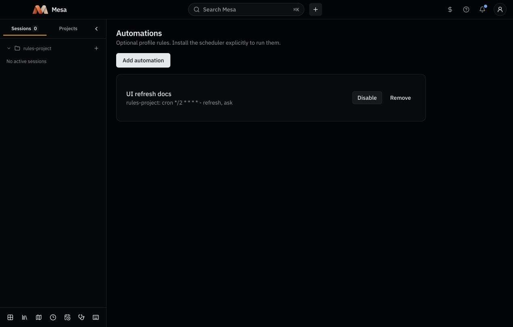

# Automation rules qualification (#421)

Date: 2026-10-02. Tested branch from `8da5a06`. This is rule-management evidence, not scheduler, native notification or vendor-source qualification for #39.

| Check | Evidence |
| --- | --- |
| Real CLI in a new named throwaway profile | `init`, `vault init`, `register --create`, automation `list`, `add`, `disable`, `enable`, `list`, `remove`, `list`, all with JSON and successful envelopes. Final list empty. |
| Optional rules and privacy | Initial list created no rule file; add wrote mode `0600`; separate CLI invocations read the saved toggle. |
| Inert behavior | Hashes of every throwaway vault file and project `mesa.yaml` unchanged during CRUD. Existing profiles' config, registry and automation-file hashes unchanged. Mesa `launchctl list` rows unchanged. |
| Rendered app, real CLI bridge | The full App rendered locally in Chrome with a bridge spawning the built CLI under the same throwaway profile. Sidebar Automations opened the empty screen. Add saved a cron Refresh rule; Disable, Enable and confirmed Remove persisted. Final screen showed no automations. Console warnings/errors: none after the bridge was started correctly. |
| Evidence boundary | Browser rendering uses a controlled OS platform; it does not prove Tauri/native notification delivery. Each app command reached the real CLI, rather than a fixture command response. |
| Cleanup | Closed the test tab and stopped its preview server. Removed the new profile, vault, checkout, and preview entry files. No LaunchAgent was installed. |

Focused caller-interface checks: `packages/core/src/automations/rules.test.ts`, `packages/cli/src/commands/automations.test.ts`, and `apps/desktop/src/features/automations/AutomationsScreen.test.tsx` (six tests). These cover malformed definitions, incompatible fields, all twelve trigger/action combinations, profile isolation, no runtime effects, form choices, rejected-save retention, toggles and confirmed removal. The full merge gate and the independent Standards/Spec review are recorded in the PR.
