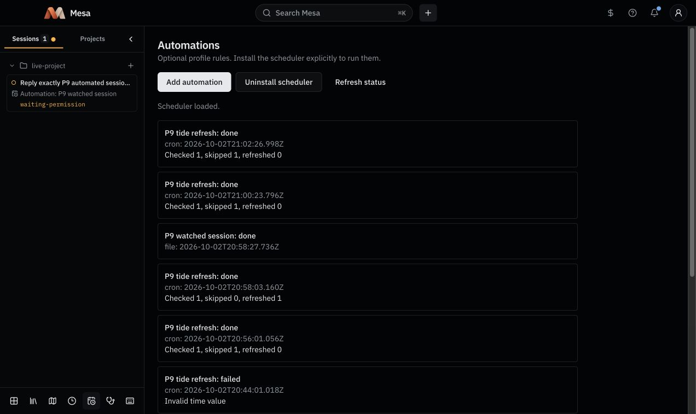
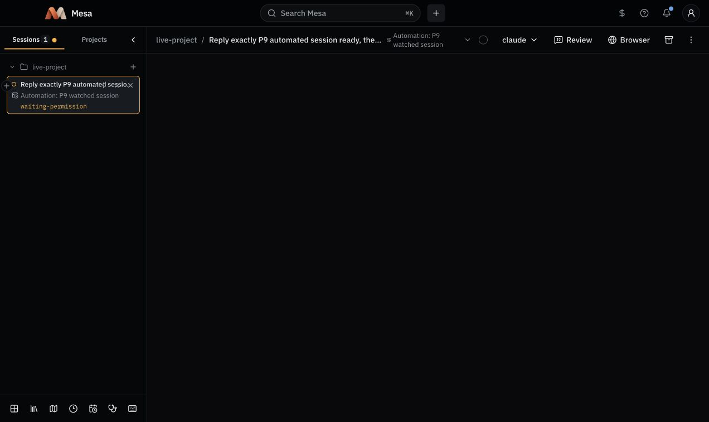

# Profile automation scheduler qualification

Date: 2026-10-02. Issue: #423, child of #39.

The real macOS GUI LaunchAgent used a disposable Mesa profile, project and vault, an invented HTTP source, and installed Claude Code. No existing profile or vault was used. The profile's private plist passed `plutil -lint`; `launchctl print gui/<uid>/<label>` showed the absolute Node/CLI invocation and profile working directory. The job ran every 30 seconds with an explicit PATH and UTF-8 locale.

| Check | Observed result |
| --- | --- |
| No rules and no install | Tick returned inert, with no worker or LaunchAgent. |
| Two-minute cron, unchanged source | 20:56:01 UTC: checked 1, skipped 1, refreshed 0; snapshot, notes and project data hashes unchanged. |
| Edit before next two-minute cron | 20:58:03 UTC: checked 1, skipped 0, refreshed 1. Real Claude notes completed at 20:58:20 UTC; the user's invented `keep` block remained. |
| File transition | 20:58:27 UTC: normal interactive Claude session created. Its persisted record identified `P9 watched session` and the automation run. |
| Continued cadence | 21:00 and 21:02 UTC runs skipped the unchanged source. |
| Automations screen | Showed loaded status, uninstall control, completed runs and checked/skipped/refreshed counts. |
| Session Board | Sidebar and selected session header showed `Automation: P9 watched session`. |
| Project Context | Showed the enabled two-minute refresh schedule and the saved last-run counts. |
| Uninstall | Job unloaded, plist removed, worker and lifecycle claims cleared, and all rule-created managed sessions ended. Existing Mesa jobs and baseline real-profile config/registry hashes were unchanged. |

The first native attempt exposed a minimal-launchd-locale failure: tmux replaced its tab separators with underscores, causing an invalid timestamp. An isolated invocation reproduced it. Setting `LANG` and `LC_CTYPE` to `en_US.UTF-8` fixed the shared launch environment; the table above records the successful rerun. The prior failure remains visible in history.

The screenshots use the real React app calling the actual profile-pinned Mesa CLI. Browser preview platform adapters are test implementations, so these pictures prove UI presentation, not native terminal rendering, OS notifications or provider revocation. Those failure and notification checks belong to #424.

Public-interface checks additionally cover durable Ask approval, serialized profile dispatch, Faro state transitions and decision probabilities, interrupted worker cleanup, competing install/uninstall, cancellation during dispatch, and explicit recovery guidance after an interrupted installation. These use controlled core dependencies; they are separate from the live evidence above.
