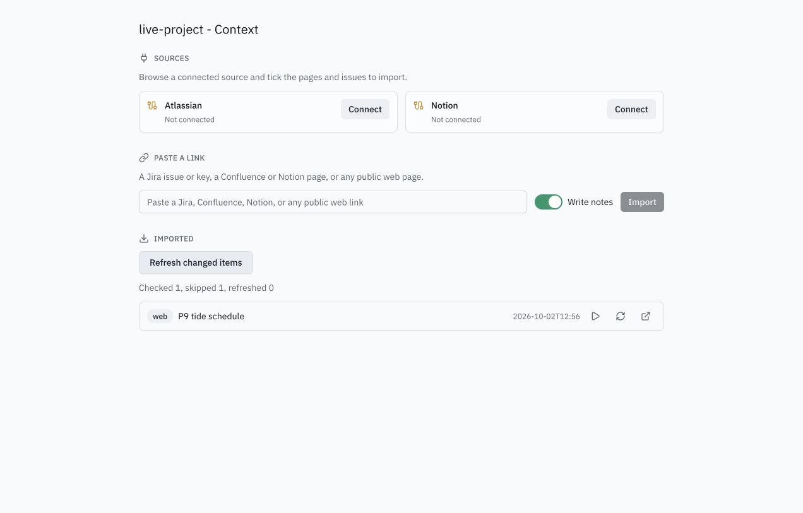
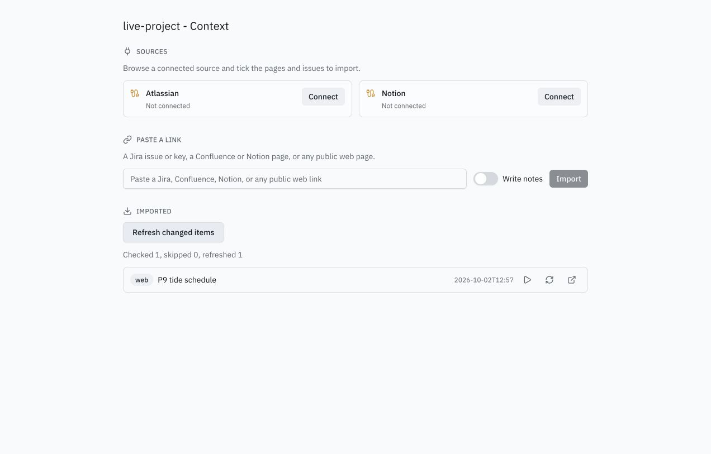

# Change-aware refresh qualification (#422)

Date: 2026-10-02. Branch: `feat/p9-changed-refresh`.

## Observed

- Focused import, Notion, receipt Bases, CLI, and Context tab tests: 37 passed including profile path checks. Native connector fixtures prove Confluence version, Jira updated time, and Notion last-edited time skip their content calls. The source preflight fails on a late inaccessible item without adding earlier snapshots or notes. 51 changed web items produce notes batches of 50 and 1 using Claude despite an Antigravity profile default. Legacy snapshots seed their revision once. A failed first notes batch retains all 51 pending URLs; notes-off and late source failure leave that list intact, then recovery lands notes in 50+1 batches from the same snapshots.
- `pnpm verify`: lint, typecheck, 200 files / 1,261 JS tests, eight Rust tests, and all builds passed. The existing lint warning in CloneProjectDialog.test.tsx and Vite's bundle-size warning remain.
- Actual CLI, real HTTP source on loopback, real Claude notes runs, fresh profile `p9q39-live-20261002a`: initial import session `ys6zes0p`, unchanged check `checked: 1, skipped: 1, refreshed: 0` with a receipt and identical raw/wiki/project hashes; changed check `checked: 1, skipped: 0, refreshed: 1` with a new snapshot and successful notes run preserving `<!-- keep -->` text. A following check skipped again. Existing profile configuration/registry/rule hashes and Mesa launchctl rows matched the baseline.
- Real CLI recovery: a temporary skill-entry collision caused a notes failure after snapshot creation. Restoring the skill entry and checking again returned `refreshed: 0`, `skipped: 1`, `notesRetried: 1`; real Claude session `9f674qyh` updated the note from exactly the same snapshot and retained the kept text. The following check ran no notes agent. The temporary collision was removed.
- Actual Context tab component in Chrome, HTTP bridge to that real CLI pinned to the throwaway profile: **Refresh changed items** produced both counts below. Write notes off passed `--no-notes`; the edited source produced a snapshot without a notes run. Captured CLI requests returned exit 0. The browser console had no errors or warnings.

## Evidence boundary

The notes runs above used the installed Claude provider, not a scripted agent. The source was invented content served over actual loopback HTTP. Native vendor revision behavior has controlled API tests here; a live Atlassian connection, scheduled launchd runs, revocation, native failure notification, and uninstall belong to #423/#424 and remain unqualified by this report. The UI run exercised the real component and CLI, with controlled OS services; it does not qualify the packaged Tauri bridge.

The temporary preview source/config and its browser tab/server were removed. The disposable profile, project, vault, and loopback source remain solely for #39's subsequent scheduler qualification; all are removed during #39 closeout.
